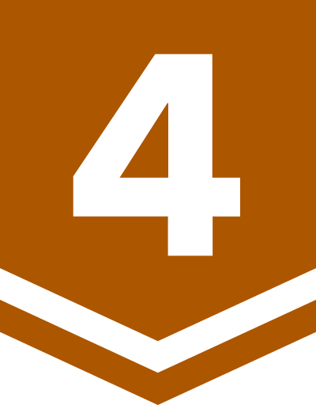

# BOJ

**백준 문제 풀이 저장소**

<h3>ftw_0x00</h3>

*( [solved.ac](https://solved.ac/ftw_0x00) | [BOJ](https://acmicpc.net/ftw_0x00) )*

rate: **1638** | solved: **880** | class: **4**

업데이트: 25.06.12. 16:31:30 (KST)

| 번호 | 제목 | 레벨 | 코드 |
|:---:|:---:|:---:|:---:|
| 1000 | A+B |  | [Python](./01xxx/1000.py) |
| 1001 | A-B |  | [Python](./01xxx/1001.py) |
| 1002 | 터렛 |  | [Python](./01xxx/1002.py) |
| 2022 | 사다리 |  | [Python](./02xxx/2022.py) |
| 15235 | Olympiad Pizza |  | [Python](./15xxx/15235.py) |
| 29986 | Amusement Park Adventure |  | [C++](./29xxx/29986.cpp) |
| 30319 | Advance to Taoyuan Regional |  | [Python](./30xxx/30319.py) |

