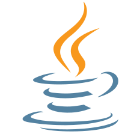

# BOJ

**백준 문제 풀이 저장소**

*( [solved.ac](https://solved.ac/ftw_0x00) | [BOJ](https://acmicpc.net/user/ftw_0x00) )*

rate: **1665** | solved: **1104** | class: **4**

저장된 문제 수: **207**

업데이트: 25.10.08. 22:04:37 (KST)

| 번호 | 제목 | 레벨 | 코드 |
|:---:|:---:|:---:|:---:|
| 1000 | A+B |  |  |
| 1001 | A-B |  |  |
| 1002 | 터렛 |  |  |
| 1003 | 피보나치 함수 |  |  |
| 1004 | 어린 왕자 |  |  |
| 1005 | ACM Craft |  |  |
| 1007 | 벡터 매칭 |  |  |
| 1008 | A/B |  |  |
| 1009 | 분산처리 |  |  |
| 1010 | 다리 놓기 |  |  |
| 1011 | Fly me to the Alpha Centauri |  |  |
| 1012 | 유기농 배추 |  |  |
| 1013 | Contact |  |  |
| 1015 | 수열 정렬 |  |  |
| 1016 | 제곱 ㄴㄴ 수 |  |  |
| 1018 | 체스판 다시 칠하기 |  |  |
| 1021 | 회전하는 큐 |  |  |
| 1022 | 소용돌이 예쁘게 출력하기 |  |  |
| 1025 | 제곱수 찾기 |  |  |
| 1026 | 보물 |  |  |
| 1027 | 고층 건물 |  |  |
| 1029 | 그림 교환 |  |  |
| 1032 | 명령 프롬프트 |  |  |
| 1034 | 램프 |  |  |
| 1036 | 36진수 |  |  |
| 1037 | 약수 |  |  |
| 1038 | 감소하는 수 |  |  |
| 1052 | 물병 |  |  |
| 1059 | 좋은 구간 |  |  |
| 1069 | 집으로 |  |  |
| 1074 | Z |  |  |
| 1075 | 나누기 |  |  |
| 1076 | 저항 |  |  |
| 1100 | 하얀 칸 |  |  |
| 1124 | 언더프라임 |  |  |
| 1138 | 한 줄로 서기 |  |  |
| 1141 | 접두사 |  |  |
| 1159 | 농구 경기 |  |  |
| 1173 | 운동 |  |  |
| 1182 | 부분수열의 합 |  |  |
| 1189 | 컴백홈 |  |  |
| 1205 | 등수 구하기 |  |  |
| 1225 | 이상한 곱셈 |  |  |
| 1233 | 주사위 |  |  |
| 1303 | 전쟁 - 전투 |  |  |
| 1309 | 동물원 |  |  |
| 1325 | 효율적인 해킹 |  |  |
| 1389 | 케빈 베이컨의 6단계 법칙 |  |  |
| 1406 | 에디터 |  |  |
| 1515 | 수 이어 쓰기 |  |  |
| 1547 | 공 |  |  |
| 1806 | 부분합 |  |  |
| 1865 | 웜홀 |  |  |
| 1876 | 튕기는 볼링공 |  |  |
| 1967 | 트리의 지름 |  |  |
| 1991 | 트리 순회 |  |  |
| 2010 | 플러그 |  |  |
| 2022 | 사다리 |  |  |
| 2042 | 구간 합 구하기 |  |  |
| 2239 | 스도쿠 |  |  |
| 2437 | 저울 |  |  |
| 2448 | 별 찍기 - 11 |  |  |
| 2467 | 용액 |  |  |
| 2468 | 안전 영역 |  |  |
| 2587 | 대표값2 |  |  |
| 2805 | 나무 자르기 |  |  |
| 2897 | CUDOVISTE |  |  |
| 3003 | BIJELE |  |  |
| 3047 | ABC |  |  |
| 3749 | Build Your Home |  |  |
| 4101 | 크냐? |  |  |
| 4900 | 7 더하기 |  |  |
| 4948 | 베르트랑 공준 |  |  |
| 4963 | 섬의 개수 |  |  |
| 5063 | TGN |  |  |
| 5489 | Numbers |  |  |
| 5525 | IOIOI |  |  |
| 5622 | 다이얼 |  |  |
| 5639 | 이진 검색 트리 |  |  |
| 5928 | Contest Timing |  |  |
| 6031 | Feeding Time |  |  |
| 6103 | Sand Castle |  |  |
| 6439 | 교차 |  |  |
| 6494 | Another lottery |  |  |
| 6549 | 히스토그램에서 가장 큰 직사각형 |  |  |
| 6768 | Don’t pass me the ball! |  |  |
| 6784 | Multiple Choice |  |  |
| 6973 | Dynamic Dictionary Coding |  |  |
| 7287 | 등록 |  |  |
| 7360 | Undercut |  |  |
| 7562 | 나이트의 이동 |  |  |
| 7662 | Dual Priority Queue |  |  |
| 8370 | Plane |  |  |
| 9012 | 괄호 |  |  |
| 9465 | 스티커 |  |  |
| 9493 | 길면 기차, 기차는 빨라, 빠른 것은 비행기 |  |  |
| 9517 | VOLIM |  |  |
| 9663 | N-Queen |  |  |
| 9912 | Lexical |  |  |
| 9935 | 문자열 폭발 |  |  |
| 10026 | 적록색약 |  |  |
| 10159 | 저울 |  |  |
| 10448 | 유레카 이론 |  |  |
| 10569 | 다면체 |  |  |
| 10696 | Prof. Ossama |  |  |
| 10799 | 쇠막대기 |  |  |
| 10811 | 바구니 뒤집기 |  |  |
| 10813 | 공 바꾸기 |  |  |
| 10830 | 행렬 제곱 |  |  |
| 10833 | 사과 |  |  |
| 11000 | 강의실 배정 |  |  |
| 11011 | Forged Answers |  |  |
| 11116 | 교통량 |  |  |
| 11203 | Numbers On a Tree |  |  |
| 11279 | 최대 힙 |  |  |
| 11286 | 절댓값 힙 |  |  |
| 11295 | Exercising |  |  |
| 11403 | 경로 찾기 |  |  |
| 11575 | Affine Cipher |  |  |
| 11640 | Scaling Recipes |  |  |
| 12015 | 가장 긴 증가하는 부분 수열 2 |  |  |
| 12209 | Super 2048 (Large) |  |  |
| 12268 | Meet and party (Small) |  |  |
| 12790 | Mini Fantasy War |  |  |
| 13243 | Non-decreasing subsegment |  |  |
| 13399 | Rearranging a Sequence |  |  |
| 13419 | 탕수육 |  |  |
| 13549 | 숨바꼭질 3 |  |  |
| 14003 | 가장 긴 증가하는 부분 수열 5 |  |  |
| 14007 | Small Weird Measurements |  |  |
| 14182 | Tax |  |  |
| 14241 | 슬라임 합치기 |  |  |
| 14468 | 소가 길을 건너간 이유 2 |  |  |
| 14626 | ISBN |  |  |
| 14889 | 스타트와 링크 |  |  |
| 14940 | 쉬운 최단거리 |  |  |
| 15235 | Olympiad Pizza |  |  |
| 15652 | N과 M (4) |  |  |
| 15666 | N과 M (12) |  |  |
| 15722 | 빙글빙글 스네일 |  |  |
| 15966 | 군계일학 |  |  |
| 16017 | Telemarketer or not? |  |  |
| 16928 | 뱀과 사다리 게임 |  |  |
| 16953 | A → B |  |  |
| 17009 | Winning Score |  |  |
| 17040 | The Great Revegetation (Bronze) |  |  |
| 17070 | 파이프 옮기기 1 |  |  |
| 18111 | 마인크래프트 |  |  |
| 18127 | 모형결정 |  |  |
| 18265 | MooBuzz |  |  |
| 18330 | Petrol |  |  |
| 18870 | 좌표 압축 |  |  |
| 19602 | Dog Treats |  |  |
| 20104 | Timecard |  |  |
| 20157 | 화살을 쏘자! |  |  |
| 20336 | Haughty Cuisine |  |  |
| 20352 | Circus |  |  |
| 21354 | Äpplen och päron |  |  |
| 21631 | Checkers |  |  |
| 21633 | Bank Transfer |  |  |
| 21638 | SMS from MCHS |  |  |
| 21736 | 헌내기는 친구가 필요해 |  |  |
| 21875 | Innohorse |  |  |
| 22015 | 金平糖 (Konpeito) |  |  |
| 23234 | The World Responds |  |  |
| 24264 | 알고리즘 수업 - 알고리즘의 수행 시간 3 |  |  |
| 24724 | 현대모비스와 함께하는 부품 관리 |  |  |
| 25062 | Boundary |  |  |
| 25083 | 새싹 |  |  |
| 25305 | 커트라인 |  |  |
| 25333 | 개구리 |  |  |
| 25703 | 포인터 공부 |  |  |
| 26332 | Buying in Bulk |  |  |
| 26495 | Big Number |  |  |
| 27112 | 시간 외 근무 멈춰! |  |  |
| 27566 | Blueberry Waffle |  |  |
| 27570 | Chocolate Chip Fabrication |  |  |
| 27865 | 랜덤 게임? |  |  |
| 27951 | 옷걸이 |  |  |
| 28064 | 이민희진 |  |  |
| 28225 | Flower Festival |  |  |
| 28464 | Potato |  |  |
| 29812 | 아니 이게 왜 안 돼 |  |  |
| 29986 | Altura Mínima |  |  |
| 30018 | 타슈 |  |  |
| 30319 | Advance to Taoyuan Regional |  |  |
| 31048 | Last Factorial Digit |  |  |
| 31499 | 프랙탈 수열 |  |  |
| 31925 | APC2shake! |  |  |
| 32200 | 항해 |  |  |
| 32278 | 선택 가능성이 가장 높은 자료형 |  |  |
| 32371 | 샷건 |  |  |
| 32642 | 당구 좀 치자 제발 |  |  |
| 32684 | 장기 |  |  |
| 33161 | 鉛筆 2 (Pencils 2) |  |  |
| 33165 | 徒競走 (Footrace) |  |  |
| 33169 | 所持金 (Money On Me) |  |  |
| 33170 | ブラックジャック (Blackjack) |  |  |
| 33178 | Micromasters |  |  |
| 33515 | 노트북 세 대를 가지고 왔다 |  |  |
| 33541 | 2025는 무엇이 특별할까? |  |  |
| 33612 | 피갤컵 |  |  |
| 33701 | 새천년관 |  |  |
| 33810 | SciComLove (2025) |  |  |
| 33911 | 특별상 눈치게임 |  |  |
| 33964 | 레퓨닛의 덧셈 |  |  |
| 34052 | 체육은 수학과목 입니다 2 |  |  |

