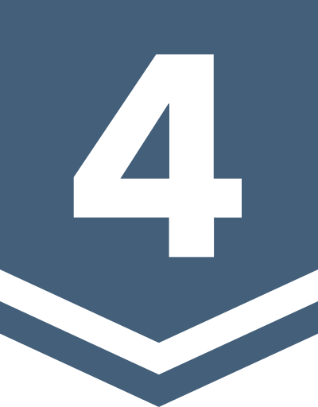

# BOJ

**백준 문제 풀이 저장소**

<h3>ftw_0x00</h3>

*( [solved.ac](https://solved.ac/ftw_0x00) | [BOJ](https://acmicpc.net/user/ftw_0x00) )*

rate: **1638** | solved: **881** | class: **4**

업데이트: 25.06.13. 17:57:28 (KST)

| 번호 | 제목 | 레벨 | 코드 |
|:---:|:---:|:---:|:---:|
| 1000 | A+B |  | [Python](./01xxx/1000.py) |
| 1001 | A-B |  | [Python](./01xxx/1001.py) |
| 1002 | 터렛 |  | [Python](./01xxx/1002.py) |
| 2022 | 사다리 |  | [Python](./02xxx/2022.py) |
| 3003 | 킹, 퀸, 룩, 비숍, 나이트, 폰 |  | [Python](./03xxx/3003.py) |
| 3047 | ABC |  | [Python](./03xxx/3047.py) |
| 4101 | 크냐? |  | [Python](./04xxx/4101.py) |
| 5063 | TGN |  | [Python](./05xxx/5063.py) |
| 6439 | 교차 |  | [C++](./06xxx/6439.cpp) |
| 6549 | 히스토그램에서 가장 큰 직사각형 |  | [C++](./06xxx/6549.cpp) |
| 7287 | 등록 |  | [C](./07xxx/7287.c) |
| 8370 | Plane |  | [C](./08xxx/8370.c) |
| 9012 | 괄호 |  | [C](./09xxx/9012.c) |
| 10026 | 적록색약 |  | [Python](./10xxx/10026.py) |
| 13419 | 탕수육 |  | [Python](./13xxx/13419.py) |
| 15235 | Olympiad Pizza |  | [Python](./15xxx/15235.py) |
| 27865 | 랜덤 게임? |  | [C++](./27xxx/27865.cpp) |
| 29986 | Amusement Park Adventure |  | [C++](./29xxx/29986.cpp) |
| 30319 | Advance to Taoyuan Regional |  | [Python](./30xxx/30319.py) |
| 32371 | 샷건 |  | [C++](./32xxx/32371.cpp) |
| 33161 | 鉛筆 2 (Pencils 2) |  | [Python](./33xxx/33161.py) |
| 33165 | 徒競走 (Footrace) |  | [Python](./33xxx/33165.py) |
| 33169 | 所持金 (Money On Me) |  | [Python](./33xxx/33169.py) |
| 33170 | ブラックジャック (Blackjack) |  | [Python](./33xxx/33170.py) |
| 33178 | Micromasters |  | [Python](./33xxx/33178.py) |
| 33515 | 노트북 세 대를 가지고 왔다 |  | [Python](./33xxx/33515.py) |
| 33541 | 2025는 무엇이 특별할까? |  | [C++](./33xxx/33541.cpp) |
| 33612 | 피갤컵 |  | [Python](./33xxx/33612.py) |
| 33810 | SciComLove (2025) |  | [Python](./33xxx/33810.py) |
| 33964 | 레퓨닛의 덧셈 |  | [Python](./33xxx/33964.py) |

