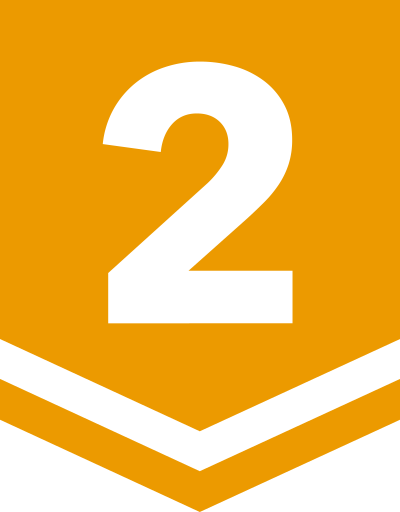

# BOJ

**백준 문제 풀이 저장소**

*( [solved.ac](https://solved.ac/ftw_0x00) | [BOJ](https://acmicpc.net/user/ftw_0x00) )*

rate: **1638** | solved: **884** | class: **4**

업데이트: 25.06.15. 12:59:28 (KST)

| 번호 | 제목 | 레벨 | 코드 |
|:---:|:---:|:---:|:---:|
| 1000 | A+B |  | [Python](./01xxx/1000.py) |
| 1001 | A-B |  | [Python](./01xxx/1001.py) |
| 1002 | 터렛 |  | [Python](./01xxx/1002.py) |
| 2022 | 사다리 |  | [Python](./02xxx/2022.py) |
| 2042 | 구간 합 구하기 |  | [Java](./02xxx/2042.java) |
| 3003 | 킹, 퀸, 룩, 비숍, 나이트, 폰 |  | [Python](./03xxx/3003.py) |
| 3047 | ABC |  | [Python](./03xxx/3047.py) |
| 4101 | 크냐? |  | [Python](./04xxx/4101.py) |
| 5063 | TGN |  | [Python](./05xxx/5063.py) |
| 6439 | 교차 |  | [C++](./06xxx/6439.cpp) |
| 6549 | 히스토그램에서 가장 큰 직사각형 |  | [C++](./06xxx/6549.cpp) |
| 6768 | Don’t pass me the ball! |  | [Python](./06xxx/6768.py) |
| 7287 | 등록 |  | [C](./07xxx/7287.c) |
| 8370 | Plane |  | [C](./08xxx/8370.c) |
| 9012 | 괄호 |  | [C](./09xxx/9012.c) |
| 9493 | 길면 기차, 기차는 빨라, 빠른 것은 비행기 |  | [Python](./09xxx/9493.py) |
| 10026 | 적록색약 |  | [Python](./10xxx/10026.py) |
| 11000 | 강의실 배정 |  | [Python](./11xxx/11000.py) |
| 11011 | Forged Answers |  | [C++](./11xxx/11011.cpp) |
| 11295 | Exercising |  | [C++](./11xxx/11295.cpp) |
| 11575 | Affine Cipher |  | [Python](./11xxx/11575.py) |
| 12015 | 가장 긴 증가하는 부분 수열 2 |  | [C++](./12xxx/12015.cpp) |
| 12790 | Mini Fantasy War |  | [Python](./12xxx/12790.py) |
| 13419 | 탕수육 |  | [Python](./13xxx/13419.py) |
| 14003 | 가장 긴 증가하는 부분 수열 5 |  | [C++](./14xxx/14003.cpp) |
| 15235 | Olympiad Pizza |  | [Python](./15xxx/15235.py) |
| 16017 | Telemarketer or not? |  | [Python](./16xxx/16017.py) |
| 17009 | Winning Score |  | [Python](./17xxx/17009.py) |
| 18127 | 모형결정 |  | [C++](./18xxx/18127.cpp) |
| 18330 | Petrol |  | [Python](./18xxx/18330.py) |
| 19602 | Dog Treats |  | [Python](./19xxx/19602.py) |
| 20104 | Timecard |  | [C++](./20xxx/20104.cpp) |
| 21875 | Innohorse |  | [C++](./21xxx/21875.cpp) |
| 22015 | 金平糖 (Konpeito) |  | [Python](./22xxx/22015.py) |
| 23234 | The World Responds |  | [Python](./23xxx/23234.py) |
| 24724 | 현대모비스와 함께하는 부품 관리 |  | [Python](./24xxx/24724.py) |
| 25083 | 새싹 |  | [C](./25xxx/25083.c) |
| 26495 | Big Number |  | [Python](./26xxx/26495.py) |
| 27566 | Blueberry Waffle |  | [C++](./27xxx/27566.cpp) |
| 27865 | 랜덤 게임? |  | [C++](./27xxx/27865.cpp) |
| 27951 | 옷걸이 |  | [C++](./27xxx/27951.cpp) |
| 28064 | 이민희진 |  | [C++](./28xxx/28064.cpp) |
| 28464 | Potato |  | [Python](./28xxx/28464.py) |
| 29986 | Amusement Park Adventure |  | [C++](./29xxx/29986.cpp) |
| 30018 | 타슈 |  | [Python](./30xxx/30018.py) |
| 30319 | Advance to Taoyuan Regional |  | [Python](./30xxx/30319.py) |
| 31048 | Last Factorial Digit |  | [Python](./31xxx/31048.py) |
| 32278 | 선택 가능성이 가장 높은 자료형 |  | [Python](./32xxx/32278.py) |
| 32371 | 샷건 |  | [C++](./32xxx/32371.cpp) |
| 33161 | 鉛筆 2 (Pencils 2) |  | [Python](./33xxx/33161.py) |
| 33165 | 徒競走 (Footrace) |  | [Python](./33xxx/33165.py) |
| 33169 | 所持金 (Money On Me) |  | [Python](./33xxx/33169.py) |
| 33170 | ブラックジャック (Blackjack) |  | [Python](./33xxx/33170.py) |
| 33178 | Micromasters |  | [Python](./33xxx/33178.py) |
| 33515 | 노트북 세 대를 가지고 왔다 |  | [Python](./33xxx/33515.py) |
| 33541 | 2025는 무엇이 특별할까? |  | [C++](./33xxx/33541.cpp) |
| 33612 | 피갤컵 |  | [Python](./33xxx/33612.py) |
| 33810 | SciComLove (2025) |  | [Python](./33xxx/33810.py) |
| 33964 | 레퓨닛의 덧셈 |  | [Python](./33xxx/33964.py) |

