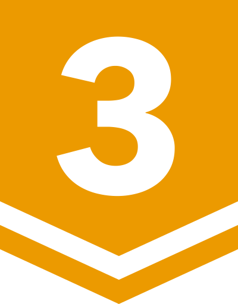

# BOJ

**백준 문제 풀이 저장소**

*( [solved.ac](https://solved.ac/ftw_0x00) | [BOJ](https://acmicpc.net/user/ftw_0x00) )*

rate: **1654** | solved: **1059** | class: **4**

저장된 문제 수: **152**

업데이트: 25.09.05. 18:23:32 (KST)

| 번호 | 제목 | 레벨 | 코드 |
|:---:|:---:|:---:|:---:|
| 1000 | A+B |  | [Python](./problems/01xxx/1000.py) |
| 1001 | A-B |  | [Python](./problems/01xxx/1001.py) |
| 1002 | 터렛 |  | [Python](./problems/01xxx/1002.py) |
| 1003 | 피보나치 함수 |  | [Python](./problems/01xxx/1003.py) |
| 1004 | 어린 왕자 |  | [C](./problems/01xxx/1004.c) |
| 1005 | ACM Craft |  | [Python](./problems/01xxx/1005.py) |
| 1007 | 벡터 매칭 |  | [Python](./problems/01xxx/1007.py) |
| 1008 | A/B |  | [Python](./problems/01xxx/1008.py) |
| 1009 | 분산처리 |  | [Python](./problems/01xxx/1009.py) |
| 1010 | 다리 놓기 |  | [Python](./problems/01xxx/1010.py) |
| 1011 | Fly me to the Alpha Centauri |  | [Python](./problems/01xxx/1011.py) |
| 1012 | 유기농 배추 |  | [Python](./problems/01xxx/1012.py) |
| 1013 | Contact |  | [C++](./problems/01xxx/1013.cpp) |
| 1016 | 제곱 ㄴㄴ 수 |  | [C++](./problems/01xxx/1016.cpp) |
| 1018 | 체스판 다시 칠하기 |  | [Python](./problems/01xxx/1018.py) |
| 1021 | 회전하는 큐 |  | [Python](./problems/01xxx/1021.py) |
| 1022 | 소용돌이 예쁘게 출력하기 |  | [C++](./problems/01xxx/1022.cpp) |
| 1025 | 제곱수 찾기 |  | [C++](./problems/01xxx/1025.cpp) |
| 1026 | 보물 |  | [C++](./problems/01xxx/1026.cpp) |
| 1076 | 저항 |  | [Python](./problems/01xxx/1076.py) |
| 1100 | 하얀 칸 |  | [Python](./problems/01xxx/1100.py) |
| 1124 | 언더프라임 |  | [Python](./problems/01xxx/1124.py) |
| 1141 | 접두사 |  | [C++](./problems/01xxx/1141.cpp) |
| 1159 | 농구 경기 |  | [Python](./problems/01xxx/1159.py) |
| 1173 | 운동 |  | [Python](./problems/01xxx/1173.py) |
| 1189 | 컴백홈 |  | [Python](./problems/01xxx/1189.py) |
| 1205 | 등수 구하기 |  | [Python](./problems/01xxx/1205.py) |
| 1225 | 이상한 곱셈 |  | [Python](./problems/01xxx/1225.py) |
| 1233 | 주사위 |  | [Python](./problems/01xxx/1233.py) |
| 1303 | 전쟁 - 전투 |  | [Python](./problems/01xxx/1303.py) |
| 1515 | 수 이어 쓰기 |  | [C++](./problems/01xxx/1515.cpp) |
| 1547 | 공 |  | [C++](./problems/01xxx/1547.cpp) |
| 1806 | 부분합 |  | [C++](./problems/01xxx/1806.cpp) |
| 1876 | 튕기는 볼링공 |  | [C++](./problems/01xxx/1876.cpp) |
| 1991 | 트리 순회 |  | [Python](./problems/01xxx/1991.py) |
| 2022 | 사다리 |  | [Python](./problems/02xxx/2022.py) |
| 2042 | 구간 합 구하기 |  | [Java](./problems/02xxx/2042.java) |
| 2437 | 저울 |  | [Python](./problems/02xxx/2437.py) |
| 2467 | 용액 |  | [C++](./problems/02xxx/2467.cpp) |
| 2587 | 대표값2 |  | [Python](./problems/02xxx/2587.py) |
| 2897 | CUDOVISTE |  | [C++](./problems/02xxx/2897.cpp) |
| 3003 | BIJELE |  | [Python](./problems/03xxx/3003.py) |
| 3047 | ABC |  | [Python](./problems/03xxx/3047.py) |
| 3749 | Build Your Home |  | [C++](./problems/03xxx/3749.cpp) |
| 4101 | 크냐? |  | [Python](./problems/04xxx/4101.py) |
| 4900 | 7 더하기 |  | [Python](./problems/04xxx/4900.py) |
| 5063 | TGN |  | [Python](./problems/05xxx/5063.py) |
| 5622 | 다이얼 |  | [C++](./problems/05xxx/5622.cpp) |
| 5928 | Contest Timing |  | [Python](./problems/05xxx/5928.py) |
| 6031 | Feeding Time |  | [Python](./problems/06xxx/6031.py) |
| 6103 | Sand Castle |  | [C++](./problems/06xxx/6103.cpp) |
| 6439 | 교차 |  | [C++](./problems/06xxx/6439.cpp) |
| 6494 | Another lottery |  | [C++](./problems/06xxx/6494.cpp) |
| 6549 | 히스토그램에서 가장 큰 직사각형 |  | [C++](./problems/06xxx/6549.cpp) |
| 6768 | Don’t pass me the ball! |  | [Python](./problems/06xxx/6768.py) |
| 6784 | Multiple Choice |  | [Python](./problems/06xxx/6784.py) |
| 7287 | 등록 |  | [C](./problems/07xxx/7287.c) |
| 7360 | Undercut |  | [C++](./problems/07xxx/7360.cpp) |
| 8370 | Plane |  | [C](./problems/08xxx/8370.c) |
| 9012 | 괄호 |  | [C](./problems/09xxx/9012.c) |
| 9493 | 길면 기차, 기차는 빨라, 빠른 것은 비행기 |  | [Python](./problems/09xxx/9493.py) |
| 9517 | VOLIM |  | [C++](./problems/09xxx/9517.cpp) |
| 9912 | Lexical |  | [Python](./problems/09xxx/9912.py) |
| 10026 | 적록색약 |  | [Python](./problems/10xxx/10026.py) |
| 10159 | 저울 |  | [C++](./problems/10xxx/10159.cpp) |
| 10569 | 다면체 |  | [C++](./problems/10xxx/10569.cpp) |
| 10696 | Prof. Ossama |  | [C++](./problems/10xxx/10696.cpp) |
| 10811 | 바구니 뒤집기 |  | [C++](./problems/10xxx/10811.cpp) |
| 10813 | 공 바꾸기 |  | [C++](./problems/10xxx/10813.cpp) |
| 10833 | 사과 |  | [Python](./problems/10xxx/10833.py) |
| 11000 | 강의실 배정 |  | [Python](./problems/11xxx/11000.py) |
| 11011 | Forged Answers |  | [C++](./problems/11xxx/11011.cpp) |
| 11116 | 교통량 |  | [C++](./problems/11xxx/11116.cpp) |
| 11295 | Exercising |  | [C++](./problems/11xxx/11295.cpp) |
| 11575 | Affine Cipher |  | [Python](./problems/11xxx/11575.py) |
| 11640 | Scaling Recipes |  | [Java](./problems/11xxx/11640.java) |
| 12015 | 가장 긴 증가하는 부분 수열 2 |  | [C++](./problems/12xxx/12015.cpp) |
| 12209 | Super 2048 (Large) |  | [C++](./problems/12xxx/12209.cpp) |
| 12268 | Meet and party (Small) |  | [C++](./problems/12xxx/12268.cpp) |
| 12790 | Mini Fantasy War |  | [Python](./problems/12xxx/12790.py) |
| 13399 | Rearranging a Sequence |  | [C++](./problems/13xxx/13399.cpp) |
| 13419 | 탕수육 |  | [Python](./problems/13xxx/13419.py) |
| 14003 | 가장 긴 증가하는 부분 수열 5 |  | [C++](./problems/14xxx/14003.cpp) |
| 14007 | Small Weird Measurements |  | [C++](./problems/14xxx/14007.cpp) |
| 14182 | Tax |  | [Python](./problems/14xxx/14182.py) |
| 14241 | 슬라임 합치기 |  | [C++](./problems/14xxx/14241.cpp) |
| 14468 | 소가 길을 건너간 이유 2 |  | [Python](./problems/14xxx/14468.py) |
| 14626 | ISBN |  | [Python](./problems/14xxx/14626.py) |
| 14889 | 스타트와 링크 |  | [Python](./problems/14xxx/14889.py) |
| 15235 | Olympiad Pizza |  | [Python](./problems/15xxx/15235.py) |
| 15722 | 빙글빙글 스네일 |  | [Python](./problems/15xxx/15722.py) |
| 15966 | 군계일학 |  | [C++](./problems/15xxx/15966.cpp) |
| 16017 | Telemarketer or not? |  | [Python](./problems/16xxx/16017.py) |
| 17009 | Winning Score |  | [Python](./problems/17xxx/17009.py) |
| 17040 | The Great Revegetation (Bronze) |  | [C++](./problems/17xxx/17040.cpp) |
| 18127 | 모형결정 |  | [C++](./problems/18xxx/18127.cpp) |
| 18265 | MooBuzz |  | [C++](./problems/18xxx/18265.cpp) |
| 18330 | Petrol |  | [Python](./problems/18xxx/18330.py) |
| 19602 | Dog Treats |  | [Python](./problems/19xxx/19602.py) |
| 20104 | Timecard |  | [C++](./problems/20xxx/20104.cpp) |
| 20157 | 화살을 쏘자! |  | [C++](./problems/20xxx/20157.cpp) |
| 20336 | Haughty Cuisine |  | [C++](./problems/20xxx/20336.cpp) |
| 20352 | Circus |  | [Python](./problems/20xxx/20352.py) |
| 21354 | Äpplen och päron |  | [Python](./problems/21xxx/21354.py) |
| 21631 | Checkers |  | [C++](./problems/21xxx/21631.cpp) |
| 21633 | Bank Transfer |  | [Python](./problems/21xxx/21633.py) |
| 21638 | SMS from MCHS |  | [C++](./problems/21xxx/21638.cpp) |
| 21875 | Innohorse |  | [C++](./problems/21xxx/21875.cpp) |
| 22015 | 金平糖 (Konpeito) |  | [Python](./problems/22xxx/22015.py) |
| 23234 | The World Responds |  | [Python](./problems/23xxx/23234.py) |
| 24264 | 알고리즘 수업 - 알고리즘의 수행 시간 3 |  | [C++](./problems/24xxx/24264.cpp) |
| 24724 | 현대모비스와 함께하는 부품 관리 |  | [Python](./problems/24xxx/24724.py) |
| 25062 | Boundary |  | [C++](./problems/25xxx/25062.cpp) |
| 25083 | 새싹 |  | [C](./problems/25xxx/25083.c) |
| 25305 | 커트라인 |  | [Python](./problems/25xxx/25305.py) |
| 25333 | 개구리 |  | [C++](./problems/25xxx/25333.cpp) |
| 25703 | 포인터 공부 |  | [C++](./problems/25xxx/25703.cpp) |
| 26332 | Buying in Bulk |  | [C++](./problems/26xxx/26332.cpp) |
| 26495 | Big Number |  | [Python](./problems/26xxx/26495.py) |
| 27112 | 시간 외 근무 멈춰! |  | [C++](./problems/27xxx/27112.cpp) |
| 27566 | Blueberry Waffle |  | [C++](./problems/27xxx/27566.cpp) |
| 27570 | Chocolate Chip Fabrication |  | [Python](./problems/27xxx/27570.py) |
| 27865 | 랜덤 게임? |  | [C++](./problems/27xxx/27865.cpp) |
| 27951 | 옷걸이 |  | [C++](./problems/27xxx/27951.cpp) |
| 28064 | 이민희진 |  | [C++](./problems/28xxx/28064.cpp) |
| 28225 | Flower Festival |  | [Python](./problems/28xxx/28225.py) |
| 28464 | Potato |  | [Python](./problems/28xxx/28464.py) |
| 29812 | 아니 이게 왜 안 돼 |  | [C++](./problems/29xxx/29812.cpp) |
| 29986 | Altura Mínima |  | [C++](./problems/29xxx/29986.cpp) |
| 30018 | 타슈 |  | [Python](./problems/30xxx/30018.py) |
| 30319 | Advance to Taoyuan Regional |  | [Python](./problems/30xxx/30319.py) |
| 31048 | Last Factorial Digit |  | [Python](./problems/31xxx/31048.py) |
| 31499 | 프랙탈 수열 |  | [C++](./problems/31xxx/31499.cpp) |
| 31925 | APC2shake! |  | [C++](./problems/31xxx/31925.cpp) |
| 32200 | 항해 |  | [Python](./problems/32xxx/32200.py) |
| 32278 | 선택 가능성이 가장 높은 자료형 |  | [Python](./problems/32xxx/32278.py) |
| 32371 | 샷건 |  | [C++](./problems/32xxx/32371.cpp) |
| 32642 | 당구 좀 치자 제발 |  | [Python](./problems/32xxx/32642.py) |
| 32684 | 장기 |  | [Python](./problems/32xxx/32684.py) |
| 33161 | 鉛筆 2 (Pencils 2) |  | [Python](./problems/33xxx/33161.py) |
| 33165 | 徒競走 (Footrace) |  | [Python](./problems/33xxx/33165.py) |
| 33169 | 所持金 (Money On Me) |  | [Python](./problems/33xxx/33169.py) |
| 33170 | ブラックジャック (Blackjack) |  | [Python](./problems/33xxx/33170.py) |
| 33178 | Micromasters |  | [Python](./problems/33xxx/33178.py) |
| 33515 | 노트북 세 대를 가지고 왔다 |  | [Python](./problems/33xxx/33515.py) |
| 33541 | 2025는 무엇이 특별할까? |  | [C++](./problems/33xxx/33541.cpp) |
| 33612 | 피갤컵 |  | [Python](./problems/33xxx/33612.py) |
| 33701 | 새천년관 |  | [Python](./problems/33xxx/33701.py) |
| 33810 | SciComLove (2025) |  | [Python](./problems/33xxx/33810.py) |
| 33911 | 특별상 눈치게임 |  | [C++](./problems/33xxx/33911.cpp) |
| 33964 | 레퓨닛의 덧셈 |  | [Python](./problems/33xxx/33964.py) |
| 34052 | 체육은 수학과목 입니다 2 |  | [Python](./problems/34xxx/34052.py) |

